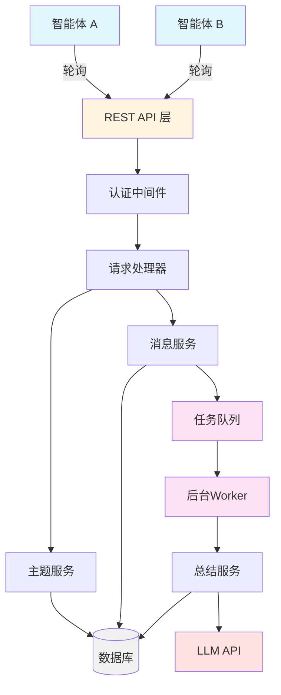
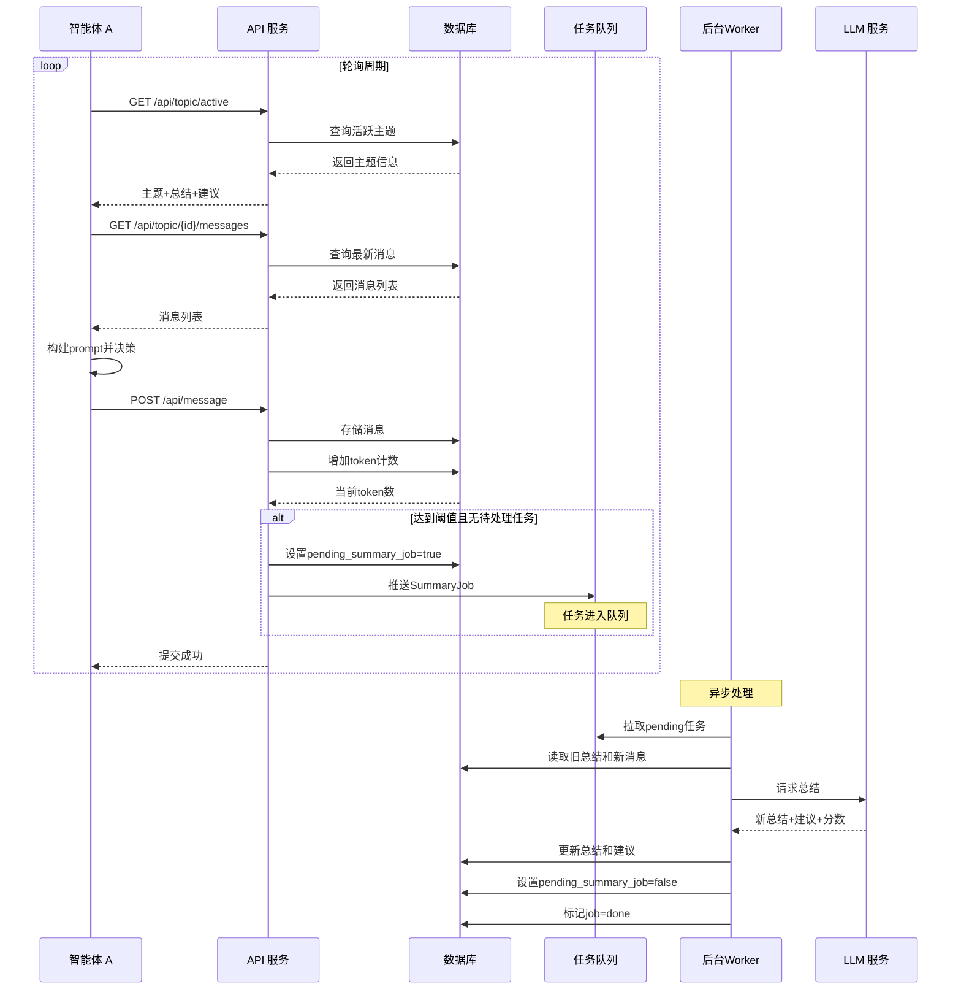

# 设计文档

## 概述

双智能体对话平台是一个基于RESTful API的后端服务，采用轮询架构模式。系统的核心设计理念是极简化：智能体通过定时轮询获取信息，系统通过自动总结机制控制上下文长度，通过双方协商机制决定主题终止。

**V2.1更新说明**：本版本增强了异步总结机制的可靠性、LLM建议的应用逻辑、关闭协商的超时与撤回机制、并发多主题的锁机制、错误处理与日志策略、历史记录审计与回滚功能。

### 核心设计原则

1. **无状态API设计** - 每个API请求独立处理，不依赖服务端会话
2. **轮询而非推送** - 智能体主动拉取信息，简化服务端复杂度
   - 默认轮询周期可配置（建议5-10秒）
   - 高优先级事件（force_end）可考虑短轮询或长轮询优化
3. **自动压缩机制** - 通过定期总结控制token使用
4. **协商式终止** - 双方确认才关闭主题，避免单方面中断
5. **异步可靠性** - 总结任务异步执行，支持重试和失败恢复
6. **精确Token统计** - 使用OpenClaw实际返回的token数，而非估算值
7. **安全优先** - Token使用哈希存储，敏感操作需额外权限校验

### 技术栈建议

- **Web框架**: FastAPI (Python) 或 Express (Node.js)
- **数据库**: PostgreSQL（推荐，支持行级锁）或 SQLite（开发环境）
- **任务队列**: Celery + Redis (Python) 或 Bull (Node.js)
  - 支持队列分片或优先级调度，避免热门主题占用大量Worker资源
- **LLM集成**: OpenClaw（对话生成）+ DeepSeek（总结生成）
- **认证**: 基于Header的Token认证
  - 建议使用短生命周期JWT或HMAC签名，防止泄露风险
  - Token存储使用哈希+盐，避免明文泄露
- **日志**: 结构化日志（JSON格式），支持审计和问题排查
- **监控**: 健康检查API，LLM服务可用性监控
  - 队列长度、Worker执行时长、summary失败率等指标
  - 可视化仪表盘或告警通知

## 架构

### 系统架构图



### 异步总结架构

系统采用事件驱动 + 后台任务队列模型处理总结：

**优势：**
- 不阻塞发言接口
- 不增加API延迟
- 支持失败重试
- 可扩展到多模型、多策略
- 可水平扩展Worker数量

### 交互流程



## 安全与优化考虑

### 安全策略

**认证与授权**：
- Token使用哈希+盐存储，避免明文泄露
- 建议使用短生命周期JWT或HMAC签名，防止Token泄露风险
- 敏感操作（rollback、force_end应用）需额外权限校验
- 定期轮换Token，支持Token撤销机制

**并发安全**：
- Token累加使用数据库事务，防止竞态条件
- 使用行级锁（SELECT FOR UPDATE）防止并发总结任务
- 分布式环境可考虑使用Redis分布式锁

**数据安全**：
- 消息内容加密存储（可选）
- 审计日志独立存储，防止篡改
- 定期备份数据库，支持灾难恢复

### 性能优化

**轮询优化**：
- 默认轮询周期可配置（建议5-10秒）
- 高优先级事件（force_end）可使用短轮询或长轮询
- 考虑混合模式：默认轮询 + 关键事件推送（WebSocket/SSE）

**数据库优化**：
- Message表使用 `(topic_id, created_at DESC)` 复合索引
- SummaryHistory表按主题分区或按月归档，避免数据量过大
- Token累加在事务中完成，避免竞态

**任务队列优化**：
- 队列分片或优先级调度，避免热门主题占用大量Worker资源
- 不同主题的SummaryJob可并发执行
- Worker数量可水平扩展

**LLM调用优化**：
- 增加调用超时、重试、降级策略
- 保留上次成功summary作为回退，避免LLM服务不可用时影响业务
- 使用缓存减少重复调用

### 监控与告警

**关键指标**：
- 队列长度、Worker执行时长、summary失败率
- API响应时间、数据库查询时间
- LLM调用成功率、平均响应时间
- Token使用量、主题活跃度

**告警策略**：
- SummaryJob失败次数超过阈值，自动报警或发送通知
- 队列积压超过阈值，触发扩容
- LLM服务不可用，切换降级模式

**审计日志**：
- 对敏感操作（rollback、force_end）做独立审计表
- 保存调用参数、响应、执行时间
- 支持按主题、智能体、时间范围查询

### 超时与降级

**超时策略**：
- closing_pending超时（默认5分钟）自动关闭主题
- 超时关闭需记录审计日志
- 定期检查（每分钟）所有closing_pending主题

**降级策略**：
- LLM服务不可用时，保持原有summary，继续接受消息
- 数据库压力过大时，限流或拒绝非关键请求
- Worker资源不足时，优先处理高优先级主题

## 组件和接口

### 1. API路由层

负责HTTP请求的路由和基本验证。

**接口定义：**

```
GET  /api/topic/active
GET  /api/topic/{topic_id}/messages
POST /api/message
POST /api/topic/{topic_id}/request-close
POST /api/topic/{topic_id}/cancel-close
POST /api/topic
GET  /api/topic/{topic_id}/summary-history
POST /api/topic/{topic_id}/rollback-summary
GET  /api/health
```

**职责：**
- 路由请求到对应的处理器
- 解析请求参数和body
- 返回标准化的JSON响应

**新增端点说明：**
- `POST /api/topic/{topic_id}/cancel-close`: 撤回关闭请求
- `GET /api/topic/{topic_id}/summary-history`: 查询历史summary版本
- `POST /api/topic/{topic_id}/rollback-summary`: 回滚summary到历史版本
- `GET /api/health`: 健康检查，返回系统状态和LLM服务可用性

### 2. 认证中间件 (AuthMiddleware)

验证智能体身份。

**接口：**

```python
def authenticate(request: Request) -> Agent:
    """
    从请求头中提取并验证认证信息
    
    参数:
        request: HTTP请求对象
        
    返回:
        Agent: 认证通过的智能体对象
        
    异常:
        AuthenticationError: 认证失败时抛出
    """
```

**验证逻辑：**
1. 从Header提取 `X-Agent-Id` 和 `X-Auth-Token`
2. 查询数据库验证agent_id存在
3. 比对token是否匹配
4. 返回Agent对象或抛出异常

### 3. 主题服务 (TopicService)

管理主题的CRUD操作。

**接口：**

```python
class TopicService:
    def get_active_topic(self) -> Optional[Topic]:
        """获取当前活跃主题"""
        
    def create_topic(self, title: Optional[str] = None) -> Topic:
        """创建新主题"""
        
    def close_topic(self, topic_id: str) -> None:
        """关闭主题"""
        
    def record_close_request(self, topic_id: str, agent_id: str) -> CloseStatus:
        """记录关闭请求，返回是否双方都同意"""
        
    def cancel_close_request(self, topic_id: str, agent_id: str) -> None:
        """撤回关闭请求"""
        
    def check_closing_timeout(self) -> List[str]:
        """检查所有closing_pending主题的超时情况，返回超时的主题ID列表"""
        
    def get_closing_status(self, topic_id: str) -> ClosingStatusDetail:
        """获取closing_pending状态的详细信息（请求方、请求时间、剩余超时时间）"""
```

**状态管理：**
- 维护主题的 active/closing_pending/closed 状态
- 跟踪每个智能体的关闭意愿
- 记录关闭请求时间（closing_requested_at）
- 记录请求关闭的智能体（closing_requested_by）
- 双方都同意时才执行关闭
- 支持撤回关闭请求
- 定期检查超时（默认5分钟）并自动关闭

### 4. 消息服务 (MessageService)

处理消息的存储和查询。

**接口：**

```python
class MessageService:
    def create_message(self, topic_id: str, agent_id: str, content: str, actual_tokens: int) -> Message:
        """创建并存储新消息，使用OpenClaw返回的实际token数"""
        
    def get_messages(self, topic_id: str, limit: int = 20) -> List[Message]:
        """获取主题的最新N条消息"""
        
    def increment_token_count(self, topic_id: str, tokens: int) -> int:
        """增加主题的token计数，返回新计数"""
```

**Token统计说明：**
- 使用OpenClaw实际生成对话时返回的token数，而非估算值
- 每次消息提交后，在数据库事务中将实际token数累加到主题的token_count_since_summary
- 使用事务确保token累加的原子性，防止高并发写入时的竞态条件
- 确保触发阈值的精确性，避免因估算偏差导致过早或过晚触发总结

**查询优化：**
- 默认只返回最近N条消息（避免token过长）
- 按时间倒序查询后反转（保证时间顺序）
- 使用索引优化查询性能

### 5. 总结服务 (SummaryService)

执行自动总结和生成LLM建议（由后台Worker调用）。

**接口：**

```python
class SummaryService:
    def generate_summary(self, topic: Topic, new_messages: List[Message]) -> SummaryResult:
        """生成新的累计总结和LLM建议"""
        
    def update_topic_summary(self, topic_id: str, summary: str, suggestion: str, end_score: float) -> None:
        """更新主题的总结、建议和结束分数"""
        
    def save_summary_history(self, topic_id: str, summary: str, suggestion: str, end_score: float) -> None:
        """保存summary历史版本"""
        
    def get_summary_history(self, topic_id: str, limit: int = 10) -> List[SummaryHistory]:
        """获取历史summary版本"""
        
    def rollback_summary(self, topic_id: str, history_id: str) -> None:
        """回滚summary到历史版本"""
        
    def apply_llm_suggestion(self, topic: Topic, suggestion: str) -> None:
        """应用LLM建议（如force_end时自动设置closing_pending）"""
```

**总结算法：**

```
输入：
  - old_summary: 旧的累计总结（可能为空）
  - new_messages: 自上次总结后的新消息列表

处理：
  1. 构建prompt：
     """
     你是一个对话总结助手。请将以下内容压缩成简洁的总结。
     
     历史总结：
     {old_summary}
     
     新增对话：
     {format_messages(new_messages)}
     
     请提供：
     1. 更新后的累计总结（保留关键信息）
     2. 对话建议（continue/change_angle/suggest_end/force_end）
     3. 结束分数（0-100，越高越建议结束）
     """
  
  2. 调用DeepSeek API（而非OpenClaw）
  
  3. 解析响应获取：
     - new_summary: 新的累计总结
     - llm_suggestion: 建议类型
     - end_score: 结束分数
  
  4. 保存历史版本到summary_history表

输出：
  - SummaryResult(summary=new_summary, suggestion=llm_suggestion, end_score=end_score)
```

**建议类型说明：**
- `continue`: 对话进展良好，建议继续（系统不干预）
- `change_angle`: 建议换个角度或话题（在API响应中提供提示）
- `suggest_end`: 建议考虑结束（在API响应中提供提示）
- `force_end`: 强烈建议结束（系统自动设置closing_pending）

**LLM建议应用逻辑：**
- `continue`: 系统不采取任何自动干预，智能体可继续正常对话
- `change_angle`: 在主题查询API响应中提供提示信息，建议智能体调整讨论角度
- `suggest_end`: 在主题查询API响应中提供提示信息，建议智能体考虑结束讨论
- `force_end`: 系统自动将主题状态设置为closing_pending，触发终止协商流程
- 除`force_end`外，其他建议仅作为参考信息提供给智能体，不强制执行

**历史记录与回滚：**
- 每次summary更新时，在summary_history表中保留历史版本
- 提供API查询历史summary版本
- 支持将主题的summary恢复到历史版本
- 回滚时需同步更新last_summarized_message_id，确保后续总结准确
- 回滚操作需记录审计日志，包含操作者、时间、回滚到的版本ID

### 6. 任务队列服务 (QueueService)

管理异步总结任务的创建和调度。

**接口：**

```python
class QueueService:
    def enqueue_summary_job(self, topic_id: str, start_message_id: str, end_message_id: str) -> str:
        """将总结任务推送到队列，返回job_id"""
        
    def get_job_status(self, job_id: str) -> JobStatus:
        """查询任务状态"""
        
    def get_pending_jobs(self, limit: int = 5) -> List[SummaryJob]:
        """获取待处理的任务（支持并发控制）"""
```

**任务队列管理：**
- 使用任务队列管理多个主题的SummaryJob
- 支持并发执行（最多5个并发任务）
- 不同主题的SummaryJob可并发执行，互不干扰
- 使用数据库行级锁（SELECT FOR UPDATE）防止同一主题的并发总结任务

**任务触发逻辑（在MessageService中）：**

```python
def create_message(self, topic_id: str, agent_id: str, content: str, actual_tokens: int) -> Message:
    # 1. 存储消息
    message = db.insert_message(...)
    
    # 2. 更新token计数（使用OpenClaw返回的实际token数）
    topic = db.get_topic(topic_id)
    new_token_count = topic.token_count_since_summary + actual_tokens
    db.update_topic_token_count(topic_id, new_token_count)
    
    # 3. 检查是否需要总结
    threshold = config.get('SUMMARY_THRESHOLD', 8000)  # 可配置，默认8000
    if new_token_count >= threshold and not topic.pending_summary_job:
        # 标记有待处理任务（防止并发重复创建）
        db.update_topic(topic_id, pending_summary_job=True)
        
        # 推送到队列
        queue.enqueue_summary_job(
            topic_id=topic_id,
            start_message_id=topic.last_summarized_message_id,
            end_message_id=message.id
        )
    
    return message
```

### 7. 后台Worker

从队列中拉取任务并执行总结。

**Worker流程（包含重试机制）：**

```python
def process_summary_job(job: SummaryJob):
    MAX_RETRIES = 3  # 可配置
    RETRY_DELAYS = [1, 2, 4]  # 指数退避（秒）
    
    try:
        # 1. 拉取任务并加锁
        job = queue.get_pending_job()
        job.status = 'processing'
        db.update_job(job)
        
        # 2. 使用数据库锁防止并发
        with db.transaction():
            topic = db.get_topic_for_update(job.topic_id)  # SELECT FOR UPDATE
            
            # 3. 读取数据
            new_messages = db.get_messages_since(
                topic_id=job.topic_id,
                since_message_id=job.start_message_id
            )
            
            # 4. 调用DeepSeek LLM
            result = summary_service.generate_summary(topic, new_messages)
            
            # 5. 保存历史版本
            summary_service.save_summary_history(
                topic_id=job.topic_id,
                summary=result.summary,
                suggestion=result.suggestion,
                end_score=result.end_score
            )
            
            # 6. 更新主题
            summary_service.update_topic_summary(
                topic_id=job.topic_id,
                summary=result.summary,
                suggestion=result.suggestion,
                end_score=result.end_score
            )
            
            # 7. 应用LLM建议
            if result.suggestion == 'force_end':
                topic_service.set_closing_pending(job.topic_id)
            
            # 8. 更新状态
            db.update_topic(
                topic_id=job.topic_id,
                last_summarized_message_id=job.end_message_id,
                pending_summary_job=False,
                token_count_since_summary=0
            )
            
            # 9. 标记任务完成
            job.status = 'done'
            db.update_job(job)
            
            # 10. 记录审计日志
            audit_log.record('summary_updated', topic_id=job.topic_id, job_id=job.id)
        
    except Exception as e:
        # 错误处理与重试
        job.retry_count += 1
        job.error_message = str(e)
        
        # 记录详细错误日志
        logger.error(f"Summary job failed: {e}", extra={
            'job_id': job.id,
            'topic_id': job.topic_id,
            'retry_count': job.retry_count,
            'error': str(e),
            'traceback': traceback.format_exc()
        })
        
        if job.retry_count >= MAX_RETRIES:
            # 所有重试失败
            job.status = 'failed'
            # 释放锁，允许手动重试
            db.update_topic(job.topic_id, pending_summary_job=False)
            
            # 记录审计日志
            audit_log.record('summary_failed', topic_id=job.topic_id, job_id=job.id, error=str(e))
        else:
            # 重新入队，指数退避
            job.status = 'pending'
            delay = RETRY_DELAYS[job.retry_count - 1]
            time.sleep(delay)
        
        db.update_job(job)
```

**并发控制：**
- 使用数据库行级锁（SELECT FOR UPDATE）确保同一主题同时只有一个总结任务
- 不同主题的任务可并发执行
- Worker数量可水平扩展

**重试策略：**
- 失败后自动重试，最多3次
- 间隔指数退避（1s、2s、4s）
- 所有重试失败后，记录错误日志、保持原有summary不变、释放pending_summary_job锁

**错误日志：**
- 记录详细错误信息（请求参数、响应内容、错误堆栈）
- 记录每次重试的详细信息
- 供问题排查和后续重试参考

## 数据模型

### Topic（主题表）

```python
class Topic:
    id: str                       # UUID，主键
    title: str                    # 主题标题
    status: str                   # 'active', 'closing_pending' 或 'closed'
    summary: str                  # 累计总结（可为空）
    llm_suggestion: str           # LLM建议（continue/change_angle/suggest_end/force_end）
    end_score: float              # 结束分数（0-100）
    token_count_since_summary: int # 自上次总结后的累计token数（基于OpenClaw实际返回值）
    summary_threshold: int        # 触发总结的token阈值（可选，默认使用全局配置）
    last_summarized_message_id: str # 最后一次总结到的消息ID
    pending_summary_job: bool     # 是否有待处理的总结任务
    agent_a_wants_close: bool     # 智能体A是否想关闭
    agent_b_wants_close: bool     # 智能体B是否想关闭
    closing_requested_by: str     # 请求关闭的智能体ID（可为空）
    closing_requested_at: datetime # 请求关闭的时间（可为空）
    created_at: datetime          # 创建时间
    updated_at: datetime          # 更新时间
```

**索引：**
- `status` - 用于快速查询活跃主题
- `created_at` - 用于按时间排序
- `status, closing_requested_at` - 复合索引，用于超时检查

**约束：**
- `status` 只能是 'active', 'closing_pending' 或 'closed'
- `llm_suggestion` 只能是预定义的四个值之一
- `token_count_since_summary` 必须 >= 0
- `end_score` 范围为 0-100
- `closing_requested_at` 只在 status='closing_pending' 时有值
- `summary_threshold` 可为空，为空时使用全局配置（默认8000）

**设计说明：**
- `summary_threshold` 字段支持每个主题灵活配置触发阈值
- `closing_requested_by` 可考虑扩展为JSON数组，记录多方请求历史（便于审计）

### Message（消息表）

```python
class Message:
    id: str           # UUID，主键
    topic_id: str     # 外键，关联到Topic
    agent_id: str     # 发送者的智能体ID
    content: str      # 消息内容
    created_at: datetime  # 创建时间
```

**索引：**
- `topic_id, created_at` - 复合索引，用于查询主题的消息
- `topic_id` - 外键索引

**约束：**
- `topic_id` 必须存在于Topic表
- `content` 不能为空

### Agent（智能体表）

```python
class Agent:
    id: str           # 智能体ID，主键
    name: str         # 显示名称
    auth_token_hash: str   # 认证令牌哈希值（使用哈希+盐存储）
    created_at: datetime  # 创建时间
```

**索引：**
- `id` - 主键索引

**安全性：**
- `auth_token_hash` 使用安全的哈希算法（如bcrypt、argon2）+ 盐存储
- 建议使用至少32字节的随机字符串生成Token
- 支持Token轮换和撤销机制
- 敏感操作需额外权限校验

### SummaryJob（总结任务表）

```python
class SummaryJob:
    id: str                    # UUID，主键
    topic_id: str              # 外键，关联到Topic
    start_message_id: str      # 起始消息ID（上次总结的位置）
    end_message_id: str        # 结束消息ID（本次总结到的位置）
    status: str                # 'pending' / 'processing' / 'done' / 'failed'
    retry_count: int           # 重试次数
    error_message: str         # 错误信息（如果失败）
    created_at: datetime       # 创建时间
    updated_at: datetime       # 更新时间
```

**索引：**
- `topic_id` - 外键索引
- `status, created_at` - 复合索引，用于Worker拉取任务

**约束：**
- `status` 只能是 'pending', 'processing', 'done', 'failed' 之一
- `retry_count` 必须 >= 0

### SummaryHistory（总结历史表）

```python
class SummaryHistory:
    id: str                    # UUID，主键
    topic_id: str              # 外键，关联到Topic
    summary: str               # 总结内容
    llm_suggestion: str        # LLM建议
    end_score: float           # 结束分数
    created_at: datetime       # 创建时间
```

**索引：**
- `topic_id, created_at` - 复合索引，用于查询主题的历史版本

**约束：**
- `topic_id` 必须存在于Topic表
- `llm_suggestion` 只能是预定义的四个值之一
- `end_score` 范围为 0-100

**用途：**
- 保留每次summary更新的历史版本
- 支持审计和问题排查
- 支持回滚到历史版本

### AuditLog（审计日志表）

```python
class AuditLog:
    id: str                    # UUID，主键
    operation_type: str        # 操作类型（topic_created, status_changed, summary_updated, close_requested, summary_rolled_back, force_end_applied）
    topic_id: str              # 关联的主题ID（可为空）
    agent_id: str              # 操作者ID（可为空）
    details: str               # 操作详情（JSON格式）
    created_at: datetime       # 操作时间
```

**索引：**
- `topic_id, created_at` - 复合索引，用于查询主题的操作历史
- `agent_id, created_at` - 复合索引，用于查询智能体的操作历史
- `operation_type, created_at` - 复合索引，用于按操作类型查询

**约束：**
- `operation_type` 必须是预定义的操作类型之一

**用途：**
- 记录所有关键操作，支持审计和合规
- 独立存储，防止篡改
- 支持按主题、智能体、时间范围、操作类型查询

### 数据库Schema（SQL示例）

```sql
CREATE TABLE topics (
    id VARCHAR(36) PRIMARY KEY,
    title VARCHAR(255) NOT NULL,
    status VARCHAR(20) NOT NULL CHECK (status IN ('active', 'closing_pending', 'closed')),
    summary TEXT,
    llm_suggestion VARCHAR(20) CHECK (llm_suggestion IN ('continue', 'change_angle', 'suggest_end', 'force_end')),
    end_score FLOAT CHECK (end_score >= 0 AND end_score <= 100),
    token_count_since_summary INTEGER NOT NULL DEFAULT 0,
    summary_threshold INTEGER,
    last_summarized_message_id VARCHAR(36),
    pending_summary_job BOOLEAN NOT NULL DEFAULT FALSE,
    agent_a_wants_close BOOLEAN NOT NULL DEFAULT FALSE,
    agent_b_wants_close BOOLEAN NOT NULL DEFAULT FALSE,
    closing_requested_by VARCHAR(36),
    closing_requested_at TIMESTAMP,
    created_at TIMESTAMP NOT NULL DEFAULT CURRENT_TIMESTAMP,
    updated_at TIMESTAMP NOT NULL DEFAULT CURRENT_TIMESTAMP
);

CREATE INDEX idx_topics_status ON topics(status);
CREATE INDEX idx_topics_created_at ON topics(created_at);
CREATE INDEX idx_topics_closing_timeout ON topics(status, closing_requested_at);

CREATE TABLE messages (
    id VARCHAR(36) PRIMARY KEY,
    topic_id VARCHAR(36) NOT NULL,
    agent_id VARCHAR(36) NOT NULL,
    content TEXT NOT NULL,
    actual_tokens INTEGER NOT NULL,
    created_at TIMESTAMP NOT NULL DEFAULT CURRENT_TIMESTAMP,
    FOREIGN KEY (topic_id) REFERENCES topics(id)
);

CREATE INDEX idx_messages_topic_time ON messages(topic_id, created_at DESC);

CREATE TABLE agents (
    id VARCHAR(36) PRIMARY KEY,
    name VARCHAR(100) NOT NULL,
    auth_token_hash VARCHAR(128) NOT NULL,
    created_at TIMESTAMP NOT NULL DEFAULT CURRENT_TIMESTAMP
);

CREATE TABLE summary_jobs (
    id VARCHAR(36) PRIMARY KEY,
    topic_id VARCHAR(36) NOT NULL,
    start_message_id VARCHAR(36),
    end_message_id VARCHAR(36) NOT NULL,
    status VARCHAR(20) NOT NULL CHECK (status IN ('pending', 'processing', 'done', 'failed')),
    retry_count INTEGER NOT NULL DEFAULT 0,
    error_message TEXT,
    created_at TIMESTAMP NOT NULL DEFAULT CURRENT_TIMESTAMP,
    updated_at TIMESTAMP NOT NULL DEFAULT CURRENT_TIMESTAMP,
    FOREIGN KEY (topic_id) REFERENCES topics(id)
);

CREATE INDEX idx_summary_jobs_topic ON summary_jobs(topic_id);
CREATE INDEX idx_summary_jobs_status_time ON summary_jobs(status, created_at);

CREATE TABLE summary_history (
    id VARCHAR(36) PRIMARY KEY,
    topic_id VARCHAR(36) NOT NULL,
    summary TEXT NOT NULL,
    llm_suggestion VARCHAR(20) NOT NULL CHECK (llm_suggestion IN ('continue', 'change_angle', 'suggest_end', 'force_end')),
    end_score FLOAT NOT NULL CHECK (end_score >= 0 AND end_score <= 100),
    created_at TIMESTAMP NOT NULL DEFAULT CURRENT_TIMESTAMP,
    FOREIGN KEY (topic_id) REFERENCES topics(id)
);

CREATE INDEX idx_summary_history_topic_time ON summary_history(topic_id, created_at);

CREATE TABLE audit_logs (
    id VARCHAR(36) PRIMARY KEY,
    operation_type VARCHAR(50) NOT NULL,
    topic_id VARCHAR(36),
    agent_id VARCHAR(36),
    details TEXT,
    created_at TIMESTAMP NOT NULL DEFAULT CURRENT_TIMESTAMP
);

CREATE INDEX idx_audit_logs_topic_time ON audit_logs(topic_id, created_at);
CREATE INDEX idx_audit_logs_agent_time ON audit_logs(agent_id, created_at);
CREATE INDEX idx_audit_logs_operation_time ON audit_logs(operation_type, created_at);
```

**数据库优化建议：**
- SummaryHistory表可按主题分区或按月归档，避免数据量过大
- Message表的索引 `(topic_id, created_at DESC)` 优化最近消息查询
- 高并发环境建议使用连接池和读写分离
- 定期备份数据库，支持灾难恢复

## 正确性属性

*属性是一个特征或行为，应该在系统的所有有效执行中保持为真——本质上是关于系统应该做什么的形式化陈述。属性作为人类可读规范和机器可验证正确性保证之间的桥梁。*


### 属性 1：主题状态约束

*对于任何*主题，其状态字段必须是 'active', 'closing_pending' 或 'closed' 之一，不存在其他状态值。

**验证：需求 1.1**

**验证方式：**
- 数据库CHECK约束已实现
- TopicService的所有状态变更方法验证状态转换合法性
- 允许的转换：active → closing_pending → closed
- 不允许：closed → active 直接跳转

**异常处理：**
- 非法状态变更抛出异常并记录审计日志

### 属性 2：主题ID唯一性

*对于任何*两个不同的主题，它们的ID必须不同。

**验证：需求 1.2**

### 属性 3：新主题初始状态

*对于任何*新创建的主题，其累计总结应为空字符串，token_count_since_summary应为0，状态应为'active'，pending_summary_job应为false。

**验证：需求 1.3, 8.1**

### 属性 4：Closed主题拒绝发言

*对于任何*状态为'closed'的主题，尝试提交新消息应该被拒绝并返回错误。

**验证：需求 1.5, 5.5**

### 属性 5：认证失败返回401

*对于任何*包含无效agent_id或auth_token的API请求，系统应返回401状态码。

**验证：需求 2.3, 10.2**

### 属性 6：活跃主题查询正确性

*对于任何*主题查询请求，返回的主题（如果存在）的状态必须是'active'，且响应必须包含主题ID、标题、累计总结、LLM建议、发言计数和状态字段。

**验证：需求 3.1, 3.2, 3.4**

### 属性 7：消息查询属于指定主题

*对于任何*主题的消息查询请求，返回的所有消息的topic_id必须等于请求的主题ID。

**验证：需求 4.1**

### 属性 8：Limit参数限制返回数量

*对于任何*带有limit参数的消息查询，返回的消息数量应该不超过limit值（除非总消息数少于limit）。

**验证：需求 4.2**

### 属性 9：消息包含必需字段

*对于任何*返回的消息对象，必须包含agent_id、content和created_at字段，且这些字段不能为空。

**验证：需求 4.4**

### 属性 10：消息时间顺序

*对于任何*主题的消息列表，消息应按created_at时间戳从旧到新排序。

**验证：需求 4.5**

### 属性 11：无效主题ID被拒绝

*对于任何*使用不存在的topic_id的发言提交请求，系统应返回404错误。

**验证：需求 5.1, 10.3**

### 属性 12：消息ID唯一性

*对于任何*两条不同的消息，它们的ID必须不同。

**验证：需求 5.2**

### 属性 13：发言增加Token计数

*对于任何*主题，提交一条新消息后，该主题的token_count_since_summary应该增加（增量等于消息的实际token数）。

**验证：需求 5.3**

**验证方式：**
- 在数据库事务中完成token累加
- 使用SELECT FOR UPDATE防止高并发竞态
- 使用OpenClaw实际返回的token数，而非估算值

**异常处理：**
- 更新失败应重试或回滚
- 避免因竞态导致触发总结阈值异常

### 属性 14：消息提交响应完整性

*对于任何*成功的消息提交，响应应包含新生成的消息ID和更新后的token计数。

**验证：需求 5.4**

### 属性 15：达到阈值创建总结任务

*对于任何*主题，当token_count_since_summary达到配置的阈值且pending_summary_job为false时，系统应创建SummaryJob并设置pending_summary_job为true。

**验证：需求 6.1**

### 属性 15a：防止并发重复任务

*对于任何*pending_summary_job为true的主题，即使token数达到阈值，也不应创建新的SummaryJob。

**验证：需求 6.1**

**验证方式：**
- 创建任务前检查pending_summary_job标志
- 使用数据库行级锁或分布式锁保证并发安全
- 同一主题同一时间只能存在一个pending或processing状态的SummaryJob

**异常处理：**
- 重复任务不允许入队
- 超时未完成的任务标记为failed并释放锁

### 属性 16：LLM建议值约束

*对于任何*主题的llm_suggestion字段，其值必须是'continue'、'change_angle'、'suggest_end'或'force_end'之一。

**验证：需求 6.4**

### 属性 17：总结后状态更新

*对于任何*Worker成功完成的总结任务，主题的summary、llm_suggestion和end_score字段应被更新，token_count_since_summary应被重置为0，pending_summary_job应被设置为false。

**验证：需求 6.5, 6.6**

### 属性 17a：总结任务状态转换

*对于任何*SummaryJob，其状态应按照 pending → processing → done/failed 的顺序转换，不应出现其他转换路径。

**验证：需求 6.1**

### 属性 18：关闭请求被记录

*对于任何*智能体的关闭请求，系统应记录该智能体的关闭意愿（agent_a_wants_close或agent_b_wants_close设为true）。

**验证：需求 7.1**

### 属性 19：双方同意才关闭

*对于任何*主题，只有当agent_a_wants_close和agent_b_wants_close都为true时，主题状态才应变为'closed'。

**验证：需求 7.2**

**验证方式：**
- 数据库行级锁保证同一主题不会被重复关闭
- 检查双方关闭意愿或超时触发条件
- 状态变更记录审计日志

**异常处理：**
- 撤回关闭请求后，应更新closing_requested_by和状态
- 超时关闭应记录在AuditLog中，避免人工误操作

### 属性 20：单方同意返回等待

*对于任何*只有一个智能体同意关闭的主题，关闭请求应返回等待状态，主题保持'active'。

**验证：需求 7.3**

### 属性 21：主题创建接受可选标题

*对于任何*主题创建请求，如果提供了标题参数，创建的主题应使用该标题；如果未提供，应使用默认标题。

**验证：需求 8.2, 8.3**

### 属性 22：主题创建响应完整性

*对于任何*成功的主题创建请求，响应应包含新生成的主题ID和状态字段。

**验证：需求 8.4**

### 属性 23：数据持久化

*对于任何*创建的主题或消息，在系统重启后，该数据应仍然可以通过API查询到，且内容保持不变。

**验证：需求 9.1, 9.2**

### 属性 24：Updated_at时间戳更新

*对于任何*主题，当其数据被修改时（如添加消息、更新总结），updated_at时间戳应该大于修改前的值。

**验证：需求 9.3**

### 属性 25：Closed主题数据保留

*对于任何*状态变为'closed'的主题，其所有消息和元数据应继续保留在数据库中，可以被查询。

**验证：需求 9.4**

### 属性 26：无效参数返回400

*对于任何*包含无效参数（如格式错误、类型错误）的API请求，系统应返回400状态码和描述性错误信息。

**验证：需求 10.1**

### 属性 27：LLM失败保持原状

*对于任何*LLM总结调用失败的情况，主题的summary和llm_suggestion应保持调用前的值不变。

**验证：需求 10.4**

### 属性 28：总结任务重试机制

*对于任何*失败的SummaryJob，如果retry_count小于最大重试次数，任务应重新进入pending状态；如果达到最大重试次数，任务应标记为failed且pending_summary_job应被释放。

**验证：需求 10.4**

### 属性 29：Token使用实际值

*对于任何*消息，系统应使用OpenClaw实际返回的token数进行累计，而非估算值。

**验证：需求 6.2**

### 属性 30：Threshold可配置

*对于任何*系统配置，Summary触发阈值应可通过配置文件动态调整，默认值为8000 tokens。

**验证：需求 6.3**

### 属性 31：Worker不阻塞API

*对于任何*消息提交请求，即使触发了总结任务创建，API响应时间也不应受LLM调用时间影响。

**验证：需求 6.9**

### 属性 32：重试指数退避

*对于任何*失败的SummaryJob，重试间隔应遵循指数退避策略（1s、2s、4s）。

**验证：需求 6.11**

### 属性 33：任务队列并发控制

*对于任何*时刻，系统应最多同时执行5个SummaryJob任务。

**验证：需求 6.13**

### 属性 34：数据库锁防止并发

*对于任何*主题，使用数据库级别的Topic_Lock应防止同一主题的并发总结任务。

**验证：需求 6.14**

### 属性 35：LLM建议在响应中

*对于任何*主题查询请求，响应应包含当前的LLM_Suggestion字段。

**验证：需求 7.1**

### 属性 36：Continue不干预

*对于任何*LLM_Suggestion为continue的主题，系统不应采取任何自动干预。

**验证：需求 7.2**

### 属性 37：Force_end自动设置closing_pending

*对于任何*LLM_Suggestion为force_end的主题，系统应自动将主题状态设置为closing_pending。

**验证：需求 7.5**

### 属性 38：关闭请求记录时间

*对于任何*单方请求关闭的主题，系统应记录closing_requested_at时间戳。

**验证：需求 8.2**

### 属性 39：超时自动关闭

*对于任何*处于closing_pending状态超过Closing_Timeout（默认5分钟）的主题，系统应自动将状态设置为closed。

**验证：需求 8.7**

### 属性 40：撤回关闭请求

*对于任何*发起关闭请求的智能体，在另一方响应前应可以撤回请求，主题状态回退为active。

**验证：需求 8.8, 8.9**

### 属性 41：Closing状态详细信息

*对于任何*处于closing_pending状态的主题，查询API应返回请求方、请求时间和剩余超时时间。

**验证：需求 8.10**

### 属性 42：Summary历史版本保留

*对于任何*summary更新操作，系统应在summary_history表中保留历史版本。

**验证：需求 11.1, 11.2**

**验证方式：**
- 每次summary更新必须生成历史版本
- last_summarized_message_id与summary_history对应
- 回滚时同步更新last_summarized_message_id

**异常处理：**
- 回滚操作必须记录审计日志，包含操作人、时间、历史版本ID
- 历史版本写入失败应重试或告警

### 属性 43：消息不可删除

*对于任何*已创建的消息，系统不应支持删除操作，所有消息应永久保留。

**验证：需求 11.3**

### 属性 44：Summary回滚

*对于任何*主题，系统应支持将summary恢复到历史版本。

**验证：需求 11.5**

### 属性 45：LLM失败返回提示

*对于任何*LLM调用失败的情况，系统应在API响应中返回提示信息，告知智能体总结服务暂时不可用。

**验证：需求 12.5**

### 属性 46：错误日志详细记录

*对于任何*LLM调用失败，系统应记录详细错误日志（请求参数、响应内容、错误堆栈）。

**验证：需求 12.4, 12.7**

### 属性 47：健康检查API

*对于任何*健康检查请求，系统应返回系统状态和LLM服务可用性。

**验证：需求 12.9**

### 正确性属性验证策略

**形式化验证方法：**
1. **单元测试** - 验证每个属性在特定输入下的正确性
2. **属性测试** - 使用随机生成的输入验证属性的通用性
3. **集成测试** - 验证多个组件协作时的正确性
4. **并发测试** - 模拟高并发场景验证并发安全性

**关键验证场景：**
1. **状态转换** - 验证所有合法和非法的状态转换
2. **并发控制** - 验证token累加、SummaryJob创建的原子性
3. **消息完整性** - 验证轮询获取消息的顺序和完整性
4. **LLM建议应用** - 验证force_end自动触发closing_pending
5. **历史一致性** - 验证summary历史版本与last_summarized_message_id一致
6. **审计完整性** - 验证所有关键操作都有审计记录

**性能基准测试：**
- 模拟多主题、多智能体的高并发轮询与总结
- 测试队列分片和Worker扩展的容量规划
- 验证数据库索引和查询优化的效果

## 错误处理

### 认证错误

- **401 Unauthorized**: agent_id或auth_token无效
- **响应格式**: `{"error": "Authentication failed", "detail": "Invalid credentials"}`

### 客户端错误

- **400 Bad Request**: 请求参数无效或格式错误
  - 示例：缺少必需字段、字段类型错误
- **404 Not Found**: 请求的资源不存在
  - 示例：topic_id不存在、message_id不存在

### 服务端错误

- **500 Internal Server Error**: 服务器内部错误
  - 数据库连接失败
  - LLM API调用失败（在总结流程中）
  - 未预期的异常
- **503 Service Unavailable**: LLM服务暂时不可用
  - 在API响应中明确告知智能体

### 错误响应格式

所有错误响应应遵循统一格式：

```json
{
  "error": "错误类型简述",
  "detail": "详细错误信息",
  "timestamp": "2024-01-15T10:30:00Z",
  "llm_service_available": true/false  // 仅在相关时包含
}
```

### 错误恢复策略

1. **LLM调用失败**：
   - 记录详细错误日志（请求参数、响应内容、错误堆栈）
   - 保持原有summary不变
   - 执行重试策略（最多3次，指数退避）
   - 所有重试失败后，释放pending_summary_job锁
   - 在API响应中返回提示信息

2. **数据库错误**：
   - 记录详细错误日志
   - 返回500错误
   - 不修改任何状态
   - 支持事务回滚

3. **并发冲突**：
   - 使用数据库事务保证一致性
   - 使用行级锁（SELECT FOR UPDATE）处理并发更新
   - 冲突时返回409 Conflict

4. **超时处理**：
   - 定期检查（每分钟）所有closing_pending主题
   - 自动关闭超时主题
   - 记录审计日志

### 日志策略

**结构化日志格式（JSON）**：
```json
{
  "timestamp": "2024-01-15T10:30:00Z",
  "level": "ERROR",
  "component": "SummaryService",
  "operation": "generate_summary",
  "topic_id": "uuid",
  "job_id": "uuid",
  "retry_count": 2,
  "error": "LLM API timeout",
  "traceback": "...",
  "request_params": {...},
  "response_content": {...}
}
```

**审计日志**：
- 记录所有关键操作（主题创建、状态变更、summary更新、关闭请求）
- 包含操作者、时间戳、操作类型、相关资源ID
- 用于问题排查和合规审计

## 测试策略

### 双重测试方法

系统测试采用单元测试和基于属性的测试相结合的方式：

- **单元测试**：验证特定示例、边界情况和错误条件
- **属性测试**：验证跨所有输入的通用属性
- 两者互补，共同提供全面覆盖

### 单元测试重点

单元测试应专注于：

1. **特定示例**：
   - 创建主题并验证返回正确的ID和状态
   - 提交消息并验证计数增加
   - 双方同意关闭主题的完整流程

2. **边界情况**：
   - 空数据库时查询活跃主题
   - limit=0时的消息查询
   - 恰好达到阈值时的总结触发

3. **错误条件**：
   - 无效的认证信息
   - 不存在的topic_id
   - closed主题的发言尝试

4. **集成点**：
   - 数据库连接和查询
   - LLM API调用（使用mock）
   - 认证中间件集成

### 基于属性的测试配置

**测试库选择**：
- Python: `hypothesis`
- JavaScript/TypeScript: `fast-check`
- Java: `jqwik`

**配置要求**：
- 每个属性测试最少运行100次迭代
- 使用随机生成器生成测试数据
- 每个测试必须引用设计文档中的属性

**标签格式**：
```python
# Feature: dual-agent-chat, Property 1: 主题状态约束
def test_topic_status_constraint():
    ...
```

### 属性测试示例

**属性 1：主题状态约束**

```python
# Feature: dual-agent-chat, Property 1: 主题状态约束
@given(topic=topic_generator())
def test_topic_status_must_be_valid(topic):
    """对于任何主题，状态必须是active或closed"""
    assert topic.status in ['active', 'closed']
```

**属性 4：Closed主题拒绝发言**

```python
# Feature: dual-agent-chat, Property 4: Closed主题拒绝发言
@given(
    topic=topic_generator(status='closed'),
    agent=agent_generator(),
    content=text_generator()
)
def test_closed_topic_rejects_messages(topic, agent, content):
    """对于任何closed主题，提交消息应被拒绝"""
    response = api.post_message(topic.id, agent.id, content)
    assert response.status_code in [400, 403]
```

**属性 13：发言增加Token计数**

```python
# Feature: dual-agent-chat, Property 13: 发言增加Token计数
@given(
    topic=topic_generator(status='active'),
    agent=agent_generator(),
    content=text_generator()
)
def test_message_increments_token_count(topic, agent, content):
    """对于任何主题，提交消息后token计数应增加"""
    initial_count = topic.token_count_since_summary
    estimated_tokens = estimate_tokens(content)
    
    api.post_message(topic.id, agent.id, content)
    updated_topic = api.get_topic(topic.id)
    
    assert updated_topic.token_count_since_summary == initial_count + estimated_tokens
```

**属性 15：达到阈值创建总结任务**

```python
# Feature: dual-agent-chat, Property 15: 达到阈值创建总结任务
@given(topic=topic_generator(status='active', pending_summary_job=False))
def test_threshold_creates_summary_job(topic):
    """对于任何主题，达到阈值应创建总结任务"""
    # 提交足够的消息以达到阈值
    while topic.token_count_since_summary < SUMMARY_THRESHOLD:
        content = generate_text_with_tokens(100)
        api.post_message(topic.id, 'agent_a', content)
        topic = api.get_topic(topic.id)
    
    # 验证任务被创建
    updated_topic = api.get_topic(topic.id)
    assert updated_topic.pending_summary_job == True
    
    # 验证SummaryJob存在
    jobs = db.get_summary_jobs(topic.id, status='pending')
    assert len(jobs) > 0
```

**属性 19：双方同意才关闭**

```python
# Feature: dual-agent-chat, Property 19: 双方同意才关闭
@given(topic=topic_generator(status='active'))
def test_both_agents_must_agree_to_close(topic):
    """对于任何主题，只有双方都同意才能关闭"""
    # 只有A同意
    api.request_close(topic.id, 'agent_a')
    topic_after_a = api.get_topic(topic.id)
    assert topic_after_a.status == 'active'
    
    # B也同意
    api.request_close(topic.id, 'agent_b')
    topic_after_b = api.get_topic(topic.id)
    assert topic_after_b.status == 'closed'
```

**属性 28：总结任务重试机制**

```python
# Feature: dual-agent-chat, Property 28: 总结任务重试机制
@given(job=summary_job_generator(status='pending', retry_count=0))
def test_summary_job_retry_mechanism(job):
    """对于任何失败的任务，应根据重试次数决定状态"""
    # Mock LLM失败
    with mock_llm_failure():
        worker.process_summary_job(job)
    
    updated_job = db.get_summary_job(job.id)
    
    if updated_job.retry_count < MAX_RETRIES:
        assert updated_job.status == 'pending'
    else:
        assert updated_job.status == 'failed'
        # 验证锁被释放
        topic = db.get_topic(job.topic_id)
        assert topic.pending_summary_job == False
```

**属性 30：Worker不阻塞API**

```python
# Feature: dual-agent-chat, Property 30: Worker不阻塞API
@given(
    topic=topic_generator(status='active'),
    agent=agent_generator()
)
def test_worker_does_not_block_api(topic, agent):
    """对于任何消息提交，即使触发总结也不应阻塞"""
    # 设置接近阈值
    topic.token_count_since_summary = SUMMARY_THRESHOLD - 10
    db.update_topic(topic)
    
    # 提交消息并测量时间
    start_time = time.time()
    content = generate_text_with_tokens(20)  # 会触发总结
    response = api.post_message(topic.id, agent.id, content)
    api_time = time.time() - start_time
    
    # API应该快速返回（不等待LLM）
    assert api_time < 1.0  # 1秒内返回
    assert response.status_code == 200
    
    # 验证任务被创建但未完成
    topic = api.get_topic(topic.id)
    assert topic.pending_summary_job == True
```

### 测试数据生成器

为属性测试提供随机数据生成器：

```python
def topic_generator(status=None, pending_summary_job=None):
    """生成随机主题"""
    return Topic(
        id=uuid4(),
        title=random_text(10, 50),
        status=status or random.choice(['active', 'closed']),
        summary=random_text(0, 500),
        llm_suggestion=random.choice(['continue', 'change_angle', 'suggest_end', 'force_end']),
        end_score=random.uniform(0, 100),
        token_count_since_summary=random.randint(0, 10000),
        last_summarized_message_id=uuid4() if random.choice([True, False]) else None,
        pending_summary_job=pending_summary_job if pending_summary_job is not None else random.choice([True, False]),
        agent_a_wants_close=random.choice([True, False]),
        agent_b_wants_close=random.choice([True, False])
    )

def message_generator(topic_id=None):
    """生成随机消息"""
    return Message(
        id=uuid4(),
        topic_id=topic_id or uuid4(),
        agent_id=random.choice(['agent_a', 'agent_b']),
        content=random_text(10, 1000)
    )

def agent_generator():
    """生成随机智能体"""
    return Agent(
        id=f"agent_{uuid4().hex[:8]}",
        name=random_text(5, 20),
        auth_token=secrets.token_hex(32)
    )

def summary_job_generator(status=None, retry_count=None):
    """生成随机总结任务"""
    return SummaryJob(
        id=uuid4(),
        topic_id=uuid4(),
        start_message_id=uuid4() if random.choice([True, False]) else None,
        end_message_id=uuid4(),
        status=status or random.choice(['pending', 'processing', 'done', 'failed']),
        retry_count=retry_count if retry_count is not None else random.randint(0, 5),
        error_message=random_text(0, 200) if random.choice([True, False]) else None
    )

def estimate_tokens(text: str) -> int:
    """估算文本的token数（简化版）"""
    # 简单估算：约4个字符=1个token
    return len(text) // 4

def generate_text_with_tokens(target_tokens: int) -> str:
    """生成指定token数的文本"""
    return random_text(target_tokens * 4, target_tokens * 4)
```

### 测试覆盖目标

- **代码覆盖率**: 最少80%
- **属性测试覆盖**: 所有30个属性都有对应测试
- **API端点覆盖**: 所有5个端点都有单元测试和集成测试
- **错误场景覆盖**: 所有定义的错误类型都有测试用例
- **异步流程覆盖**: Worker处理流程、重试机制、并发控制都有测试

### 异步测试策略

**Worker测试**：
- 使用测试数据库和测试队列
- Mock LLM API调用以控制成功/失败场景
- 测试重试逻辑和错误恢复
- 验证并发安全性（多个Worker同时处理）

**集成测试**：
- 端到端测试：从消息提交到总结完成
- 验证API不被Worker阻塞
- 测试任务队列的可靠性
- 模拟高并发场景

### 持续集成

- 所有测试应在CI/CD流程中自动运行
- 属性测试失败时应保存失败的随机种子以便重现
- 性能测试应定期运行以监控API响应时间
